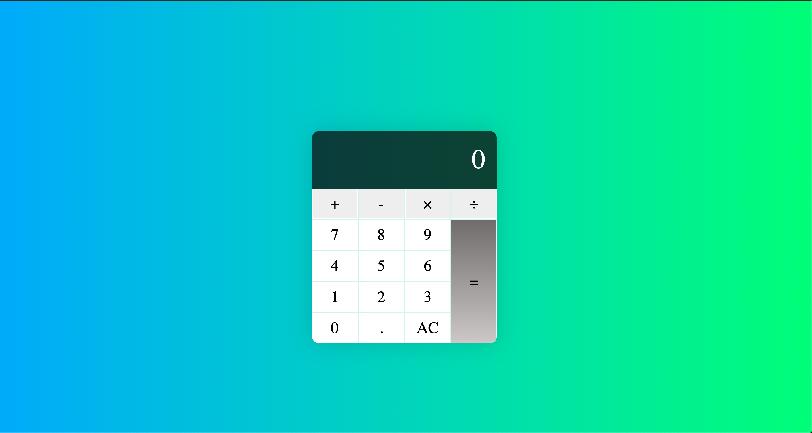

# JS-Calculator
## Description
For this project, I created a basic JavaScript calculator application. 

## Table Of Contents
* [Usage](#Usage)
* [BuiltWith](#Built-With)
* [Author](#Author)
* [Acknowledgements](#Acknowledgements )

## Usage

## Built With   
HTML    
CSS    
JavaScript    

 ## Author
 Eric LaFontsee   
 Email: elafontsee@gmail.com

## Acknowledgements
I referenced the following materials as a guide:
* https://www.freecodecamp.org/news/how-to-build-an-html-calculator-app-from-scratch-using-javascript-4454b8714b98/
* https://www.youtube.com/watch?v=j59qQ7YWLxw
